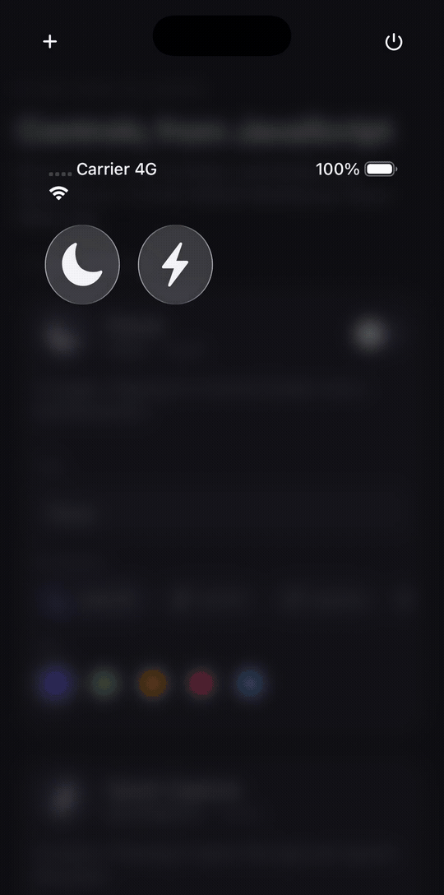
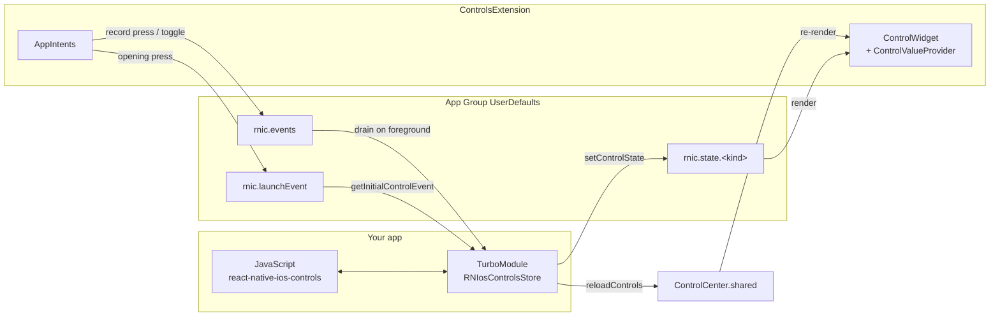

# react-native-ios-controls

[](https://github.com/giaBaoJS/react-native-ios-controls/actions/workflows/ci.yml)
[](https://www.npmjs.com/package/react-native-ios-controls)
[](./LICENSE)
[](https://developer.apple.com/documentation/widgetkit/controlwidget)
[](https://reactnative.dev/architecture/landing-page)

Control Center, Lock Screen and Action Button controls for React Native — the iOS 18
`ControlWidget`, driven from JavaScript.



---

## Why

iOS 18 let every app put a button or a toggle in Control Center, on the Lock Screen,
and behind the Action Button. It is the shortest path that exists between a user and
one action in your app — no unlock, no app switch, no navigation.

There was no React Native or Expo package for it. Controls are declared in Swift
inside a widget extension, so an RN team had to write WidgetKit code, hand-roll an
App Group bridge, and add an Xcode target by hand before shipping a single button.

This library keeps the parts that genuinely must be Swift as a small drop-in you do
not have to write, and moves everything that changes at runtime — a control's title,
symbol, tint and value, plus the events it emits — into JavaScript.

```ts
await configure({ appGroup: 'group.com.acme.app' });

await setControlState('focus', { title: 'Deep Work', sfSymbol: 'moon.fill', value: true });
await reloadControls('focus');

addControlEventListener((event) => {
  console.log(event.kind, event.action, event.value);
});
```

## Requirements

| | |
| --- | --- |
| iOS | 18.0+ for controls; the package itself installs on any supported iOS version |
| React Native | New Architecture (TurboModules) |
| Xcode | 16+ |
| Android | Installs and runs, every call is a no-op |

## Installation

```sh
npm install react-native-ios-controls
cd ios && pod install
```

Then run the setup step below — a control cannot exist without a widget extension.

## Setup

**This is the part that matters.** Controls live in a widget extension target, which
your React Native app does not have yet. One command adds it:

```sh
npx react-native-ios-controls init
```

Run it from your app root. It will:

- create a `ControlsExtension` target with a `com.apple.widgetkit-extension` Info.plist
- write entitlements for **both** the app and the extension containing the App Group
- copy the library's Swift sources onto the right targets
- back up `project.pbxproj` first, and refuse to run a second time

Then `cd ios && pod install`, and call `configure` once on app start:

```ts
import { configure } from 'react-native-ios-controls';

await configure({ appGroup: 'group.com.acme.app' });
```

The App Group defaults to `group.<your app bundle id>`. Pass `--app-group` to choose
another, `--name` to rename the target, and `--dry-run` to preview every change.

Prefer to do it by hand, or have an unusual project layout? [`docs/setup.md`](./docs/setup.md)
has the manual steps, and `example/` is a complete working integration.

> **Ship-blocking detail:** the generated `RNControlsShared.swift` belongs to **both**
> targets. An `AppIntent` that opens your app must exist in the app binary too —
> otherwise iOS rejects the press with *"openAppWhenRun is not supported in
> extensions"* and the button silently does nothing. The CLI sets this up correctly;
> if you wire it manually, do not skip it.

## Declaring controls

`init` writes a `Controls.swift` you own. Add a control by declaring one struct and
listing it in the bundle — everything else comes from the App Group at runtime:

```swift
@available(iOS 18.0, *)
struct FocusControl: ControlWidget {
  var body: some ControlWidgetConfiguration {
    rnToggleControl(
      kind: "focus",
      displayName: "Focus",
      description: "Turn Focus on or off.",
      defaultState: RNControlState(value: false, title: "Focus", sfSymbol: "moon.fill")
    )
  }
}
```

Three templates ship with the package:

| Helper | Control | Press behaviour |
| --- | --- | --- |
| `rnToggleControl` | toggle | runs a `SetValueIntent`, emits `toggle` |
| `rnButtonControl` | button | opens your app, emits `press` |
| `rnSilentButtonControl` | button | emits `press`, app stays closed |

There is no cap on how many controls you declare. `kind` is the only contract between
Swift and JavaScript.

## Quick start

```tsx
import { useEffect, useState } from 'react';
import { Text } from 'react-native';
import {
  addControlEventListener,
  configure,
  getControlState,
  reloadControls,
  setControlState,
  type ControlEvent,
} from 'react-native-ios-controls';

export function FocusPanel() {
  const [events, setEvents] = useState<ControlEvent[]>([]);

  useEffect(() => {
    const subscription = addControlEventListener((event) => {
      setEvents((previous) => [event, ...previous]);
    });
    configure({ appGroup: 'group.com.acme.app' });
    return () => subscription.remove();
  }, []);

  async function goDeep() {
    await setControlState('focus', {
      value: true,
      title: 'Deep Work',
      sfSymbol: 'moon.stars.fill',
      tint: '#7C5CFF',
    });
    await reloadControls('focus');
    const state = await getControlState('focus');
    console.log(state?.title);
  }

  return <Text onPress={goDeep}>{events.length} control events</Text>;
}
```

## API

| Export | Signature | Notes |
| --- | --- | --- |
| `configure` | `(options: ConfigureOptions) => Promise<void>` | Call once on start. Throws if `appGroup` is missing or not `group.`-prefixed. |
| `setControlState` | `(kind: string, state: ControlState) => Promise<void>` | Merges into stored state; omitted fields keep their value. |
| `getControlState` | `(kind: string) => Promise<ControlState \| null>` | `null` if the control was never written. |
| `reloadControls` | `(kind?: string) => Promise<void>` | Omit `kind` to reload every control. |
| `getInitialControlEvent` | `() => Promise<ControlEvent \| null>` | The press that launched the app, or `null`. Clears once read. |
| `addControlEventListener` | `(cb: (e: ControlEvent) => void) => EventSubscription` | Replays events buffered before the first listener attached. |
| `refreshControlEvents` | `() => Promise<void>` | Drains the queue now instead of on next foreground. |
| `isSupported` | `boolean` | `false` on Android and iOS < 18. |

```ts
type ConfigureOptions = { appGroup: string };

type ControlState = {
  value?: boolean;
  title?: string;
  subtitle?: string;
  sfSymbol?: string;
  tint?: string; // #RGB, #RRGGBB or #RRGGBBAA
};

type ControlEvent = {
  kind: string;
  action: 'press' | 'toggle';
  value?: boolean;
  id: string;
  timestamp: number;
};
```

Full reference: [`docs/API.md`](./docs/API.md).

## How it works

Your app and the widget extension are separate processes that share one App Group
container. Everything crosses through it as JSON.



Events reach your app in two ways, both through the App Group queue:

- **App running or foregrounded again** — the queue drains when the app becomes
  active, which includes dismissing Control Center over it. Listeners fire then.
- **App launched by a press** — a `rnButtonControl` press opens the app and also
  records the event as the launch event, reported by `getInitialControlEvent()`.
  The same event is delivered to listeners; de-duplicate on `event.id` if you
  consume both.

More detail: [`docs/how-controls-work.md`](./docs/how-controls-work.md).

## Platform matrix

| | Controls render | Events delivered | Calls resolve |
| --- | --- | --- | --- |
| iOS 18+ | yes | yes | yes |
| iOS 15–17 | no | no | yes, as no-ops |
| Android | no | no | yes, as no-ops |

`getControlState` resolves to `null` and listeners never fire on unsupported
platforms, so you can call the API unconditionally and branch on `isSupported` only
where it changes your UI.

## Limitations

Worth reading before you plan around this library.

- **Controls are declared statically in Swift.** WidgetKit discovers them at install
  time from the extension binary. You can restyle a control at runtime and change its
  value, but you cannot create a new `kind` from JavaScript, and a control that is not
  in `Controls.swift` cannot appear in the gallery.
- **A widget extension target is mandatory.** There is no way to host a
  `ControlWidget` inside the app binary. That is why this package ships a CLI.
- **`reloadControls` is a request, not a command.** WidgetKit coalesces and budgets
  reloads; a burst of calls will not produce a burst of re-renders. Batch your state
  writes and reload once.
- **Events are not real-time push.** A toggle flipped while your app is suspended sits
  in the App Group queue until the app is active again. The queue holds the 32 most
  recent events; older ones are dropped.
- **iOS 18.0+ only,** and controls need Xcode 16 to build.
- **The App Group must be identical** in the app entitlements, the extension
  entitlements, `RNControlsConfig.swift`, and your `configure()` call. Three of the
  four are generated together; the fourth is yours.
- **On a real device the App Group must exist in your Apple Developer account** and be
  enabled on both bundle IDs. The Simulator does not enforce this.

## Troubleshooting

**The control does not appear in the Add a Control gallery.**
Build and run once, then look under your app's name in the gallery. If it is still
missing, the extension target probably is not embedded — check that the app target has
an "Embed Foundation Extensions" phase containing `ControlsExtension.appex`.

**The control renders as a blank circle.**
The extension cannot read the App Group. On the Simulator this is almost always a
build with `CODE_SIGNING_ALLOWED=NO`, which strips entitlements — the group silently
falls back to a private, unshared store. Build with normal simulator signing.

**Pressing a button control does nothing, and the log says "openAppWhenRun is not
supported in extensions".**
`RNControlsShared.swift` is not a member of your app target. Add it there as well.

**`configure` rejects with `E_APP_GROUP_UNAVAILABLE`.**
The identifier does not match the entitlements, or the entitlements are not applied.
Confirm with `xcrun simctl get_app_container <udid> <bundle id> groups`.

**State changes do not show up in Control Center.**
Call `reloadControls()` after writing, and remember WidgetKit may coalesce reloads.

## Contributing

See [CONTRIBUTING.md](./CONTRIBUTING.md). The `example/` app is the integration test —
run it on an iOS 18+ simulator and add the controls to Control Center.

## License

MIT © Bao Nguyen
