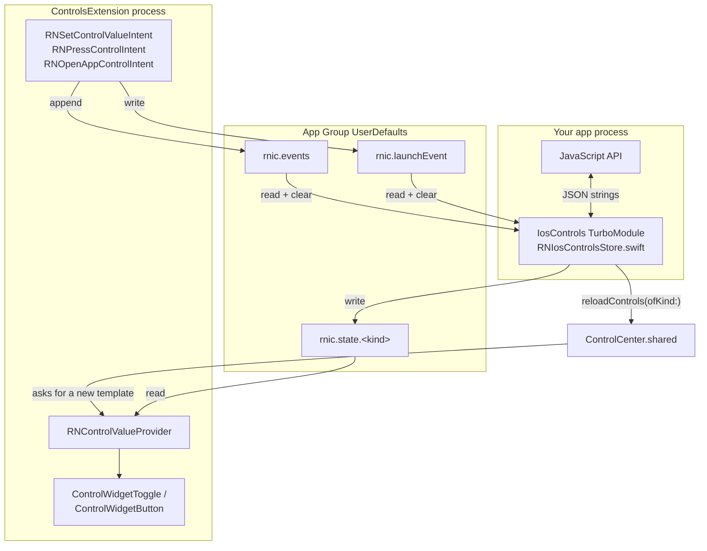

# How controls work

Useful if you want to extend the library, debug a control that will not update, or
read the App Group container by hand.

## Two processes, one container

A control is rendered by your **widget extension**, a separate process that WidgetKit
launches on demand. Your React Native app cannot call into it, and it cannot call into
your app. The only thing they share is an **App Group** container, and this library
uses exactly one thing inside it: `UserDefaults(suiteName:)`.



Because they are different processes, there is no shared memory and no callbacks. Both
sides poll or get poked by the system, which is what shapes the API.

## Storage format

Everything is a JSON **string** stored under a string key. Strings rather than
dictionaries so both implementations serialize identically and the format survives
schema changes.

### `rnic.state.<kind>`

The renderable state of one control. Written by the app, read by the extension.

```json
{ "value": true, "title": "Deep Work", "subtitle": "On", "sfSymbol": "moon.fill", "tint": "#7C5CFF" }
```

All fields optional. `setControlState` merges its patch into whatever is there, so a
write of `{"title":"X"}` leaves `tint` alone. The extension merges the result over the
`defaultState` you declared in Swift, so a field that was never written falls back to
the declaration.

`RNSetControlValueIntent` also writes here — flipping a toggle in Control Center
updates `value` immediately, without your app running.

### `rnic.events`

A queue of interactions. Appended by the extension, drained by the app.

```json
[{ "kind": "focus", "action": "toggle", "value": true, "id": "9F2C…", "timestamp": 1786537807107.7 }]
```

Capped at 32 entries; the oldest are dropped first. `drainPendingEvents` reads the key
and deletes it in one step, so an event is handed to JavaScript exactly once. The JS
layer additionally remembers the last 128 `id`s, so a redelivery caused by a retry or
a second consumer cannot produce a duplicate callback.

### `rnic.launchEvent`

The single event that opened the app, written only by `RNOpenAppControlIntent`.
`getInitialControlEvent()` reads and clears it.

This event is also in `rnic.events`, so it reaches listeners too. That is deliberate —
you can consume whichever channel suits your app — but it means both channels report
one press. De-duplicate on `id` if you use both.

## Why the intents live in two targets

`RNControlsShared.swift` is compiled into the extension **and** the app.

The extension needs the intents because that is where the toggle's `SetValueIntent`
runs. The app needs them because of a hard iOS rule: an `AppIntent` with
`openAppWhenRun = true` cannot execute inside an extension. If the type only exists in
the extension binary, pressing the button fails with:

```
LNContextErrorDomain 2001 "openAppWhenRun is not supported in extensions"
```

and nothing happens — no launch, no event, no visible error. With the type present in
the app binary, the system runs `perform()` in the app process and brings the app
forward, which is also what makes cold-start reporting possible.

## Why there are two store implementations

`RNIosControlsStore.swift` (app, inside the CocoaPods target) and `RNControlStore` in
`RNControlsShared.swift` (extension) do the same job twice.

A widget extension cannot link the app's CocoaPods targets — it is a separate binary
with its own dependencies, and pulling React Native into it would be absurd for a
button. So the app side ships in the pod, the extension side ships as a source
drop-in, and the two agree on the format documented above rather than on a shared
type. If you change one, change the other.

## When events actually arrive

There is no push channel from an extension to a running app. Delivery is therefore
tied to app lifecycle:

| Situation | When your listener fires |
| --- | --- |
| Control Center pulled down over your running app | On dismiss — the app returns to `active` and the queue drains. |
| App in the background | Next time it becomes active. |
| App not running, toggle flipped | Next launch. The event is still in the queue. |
| App not running, `rnButtonControl` pressed | The press launches the app; the event is reported on start. |

`configure()` installs the `AppState` listener and drains once immediately, which
covers the launch case. This is why `configure` must run early.

## Inspecting the container

On the Simulator:

```sh
xcrun simctl get_app_container <udid> <bundle id> groups
plutil -p "<path>/Library/Preferences/<app group>.plist"
```

```
{
  "rnic.state.focus" => "{"value":true,"tint":"#7C5CFF","title":"Deep Work","sfSymbol":"sparkles"}"
  "rnic.events" => "[{"kind":"focus","action":"toggle","value":false,"id":"D6BC…","timestamp":1786537807107.76}]"
}
```

If `get_app_container … groups` prints nothing, the entitlements were not applied and
the group does not exist. On the Simulator the usual cause is a build with
`CODE_SIGNING_ALLOWED=NO`: Xcode still writes a `-Simulated.xcent` file, but with
signing disabled it never reaches the binary, so `UserDefaults(suiteName:)` quietly
returns a private store instead of failing. Controls then render blank and no event
ever reaches the app.

## Rendering

`RNControlValueProvider` supplies the value for a control template:

- `previewValue` is synchronous and used by the add-a-control gallery. It returns the
  `defaultState` from your Swift declaration, so the gallery never blocks on storage.
- `currentValue()` is async and used for the live control. It reads the App Group and
  merges over `defaultState`.

`reloadControls` is what makes WidgetKit call `currentValue()` again. It is a request:
WidgetKit budgets reloads and coalesces bursts, so write all your state first and
reload once. A control also re-renders on its own after its own intent runs, which is
why a toggle flips instantly without your app doing anything.
